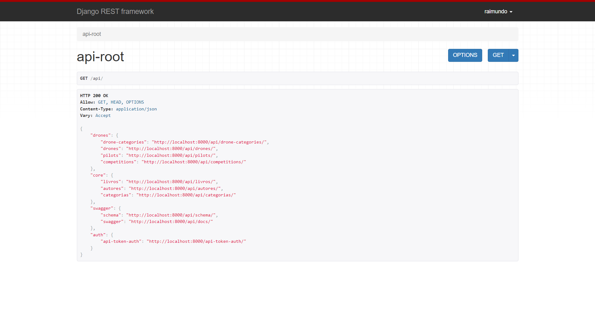

# Python Restic

### Instruções de uso

Primeiramente instalar os pacotes necessários. Use o [Pip](https://pypi.org/project/pip/) para instalar as dependências do ```requirments.txt```.

```bash
pip install -r requirements.txt
```
Após essa etápa, deve-se iniciar o banco sqlite do projeto, isso será feito executando as migrations. Use o CLI do Django, o ``manage.py``.

```bash
python manage.py migrate
```
Por último, devemos testar o servidor rodando. Usaremos mais uma vez a CLI do Django.

```bash
python manage.py runserver
```
Espere a confirmação que o servidor está rodando.

```
Watching for file changes with StatReloader
Performing system checks...

System check identified no issues (0 silenced).
October 28, 2024 - 01:23:12
Django version 5.1, using settings 'DRF.settings'
Starting development server at http://127.0.0.1:8000/
Quit the server with CONTROL-C.

```
Acesse a raiz da API ```http://127.0.0.1:8000/api```.

---

### Instruções extra

É possível formatar o código usando o pacote [Black](https://pypi.org/project/black/), uma das dependências do projeto. Para formatar o código basta usar a CLI do Black.

```bash
black <source_folder>
```
Também é possível mudar configuraçãoes desse formatador editando o arquivo ```pyproject.toml```.

---

### Apps inclusos
- Biblioteca (core)
  - Rotas
    - ```api/livros/```
    - ```api/autores/```
    - ```api/categorias/```
- Drones 
  - Rotas
    - ```api/drone-categories/```
    - ```api/drones/```
    - ```api/pilots/```
    - ```api/competitions/```
- Swagger
  - Rotas
    - ```api/schema```
    - ```api/docs```

Rota Raiz do projeto: ```api/```
  - Contém instruções dos endpoints disponíveis.
 
---


---

Aluno: Raimundo Santana Novaes Filho
