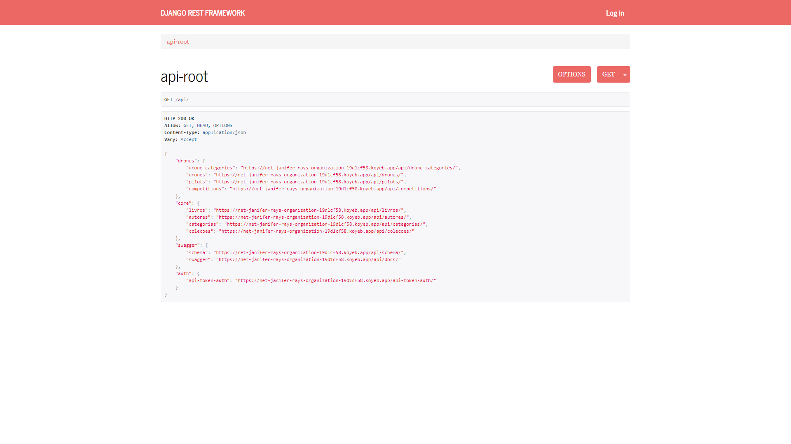

# :city_sunrise: Python Restic

### :rocket: [Versão live do projeto](https://net-janifer-rays-organization-19d1cf58.koyeb.app/api/)

---

### Instruções de uso

Antes de tudo, especifique qual configuração vai usar, exportando a variável de ambiente **DJANGO_SETTINGS_MODULE**.

```bash
export DJANGO_SETTINGS_MODULE=DRF.settings.development
```

Agora instale os pacotes necessários. Use o [Pip](https://pypi.org/project/pip/) para instalar as dependências do ```requirments.txt```.

```bash
pip install -r requirements.txt
```
Após essa etápa, deve-se iniciar o banco sqlite do projeto, isso será feito executando as migrations. Use o CLI do Django, o ``manage.py``.

```bash
python manage.py migrate
```
e feito as migrations, pode-se popular o banco.

```bash
python manage.py populate_db
```
Por último, devemos testar o servidor rodando. Usaremos mais uma vez a CLI do Django.

```bash
python manage.py runserver
```
Espere a confirmação que o servidor está rodando.

```
Watching for file changes with StatReloader
Performing system checks...

System check identified no issues (0 silenced).
October 28, 2024 - 01:23:12
Django version 5.1, using settings 'DRF.settings'
Starting development server at http://127.0.0.1:8000/
Quit the server with CONTROL-C.

```
Acesse a raiz da API ```http://127.0.0.1:8000/api```.

> Caso a página HTML não esteja estilizada, execute o comando ```python manage.py collectstatic```, que irá coletar o CSS e fontes dentro da pasta ```staticfiles/```.

---

### Instruções de uso (Docker)

O projeto também pode ser iniciado com o [Docker](https://www.docker.com), para poder inicia-lo, baixe e instale o [Docker Compose](https://docs.docker.com/compose/install/). 

Copie o arquivo ```.env.example``` para ```.env```.

> O Docker usará as configuraçãos do ```DRF.settings.base.py```, para alterar essa configuração, mude o arquivo ```.env```.

Após a instalação execute o comando ```docker-compose up -d``` na raiz do projeto.

Feito esses passos, os containers necessários vão ser subidos, para acessar o containter do Django use ```docker exec -it restful01-django sh``` e execute as migrations e seeder.

---

### Instruções extra

É possível formatar o código usando o pacote [Black](https://pypi.org/project/black/), uma das dependências do projeto. Para formatar o código basta usar a CLI do Black.

```bash
black <source_folder>
```
Também é possível mudar configuraçãoes desse formatador editando o arquivo ```pyproject.toml```.

---

### Cobertura de testes

Os pacotes de cobertura de testes e alguns testes unitários estão inclusos nos apps. Para executar os testes use ```pytest``` ou ```coverage```.

```bash
pytest <test_folder>
```

ou


```bash
coverage run -m pytest
```

Após rodar o comando coverage para fazer os testes, o coverage pode gerar imprimir um relatório no terminal ou criar uma página HTML.

```bash
coverage <html ou report>
```

Também é possível usar a CLI do pacote ```pytest-cov``` e mesclar o que o ```pytest``` e o ```coverage``` fazem em um único comando.

```bash
pytest --cov=<folder> --cov-report=<html,report>
```

> A extensão do Visual Studio Code [Live Server](https://marketplace.visualstudio.com/items?itemName=ritwickdey.LiveServer) é um otimo auxilar para utilizar com a cobertura de testes com relatório em HTML.

> 

---

### Apps inclusos
- Biblioteca (core)
  - Rotas
    - ```api/livros/```
    - ```api/autores/```
    - ```api/categorias/```
    - ```api/colecoes/```
- Drones 
  - Rotas
    - ```api/drone-categories/```
    - ```api/drones/```
    - ```api/pilots/```
    - ```api/competitions/```
- Swagger
  - Rotas
    - ```api/schema```
    - ```api/docs```

Rota Raiz do projeto: ```api/```
  - Contém instruções dos endpoints disponíveis.
 
---


---

Aluno: Raimundo Santana Novaes Filho

---


